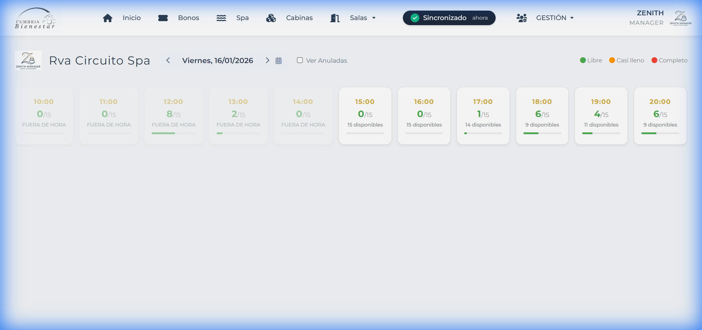
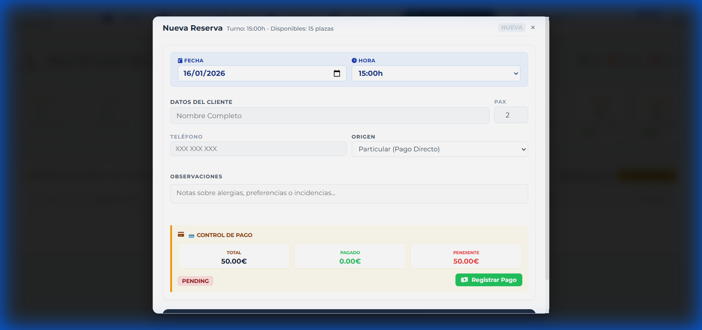
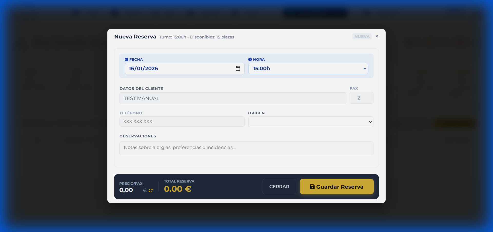
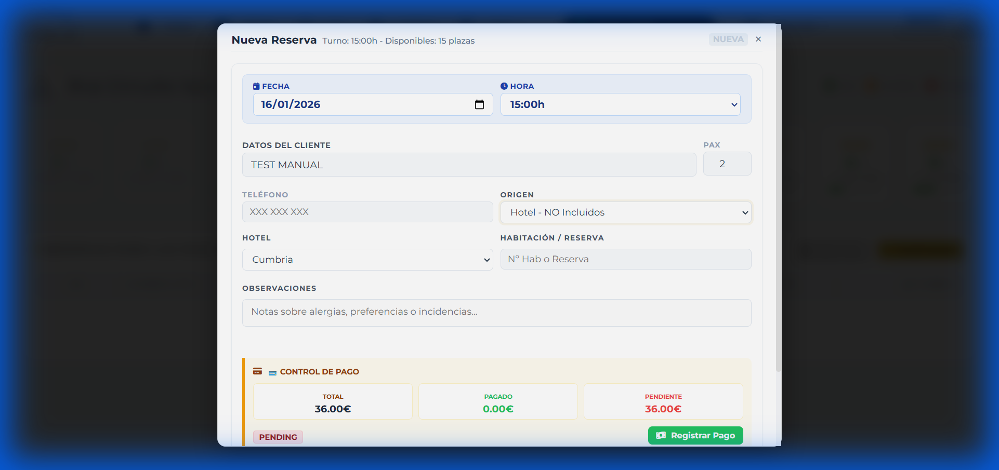

# Manual de Reservas – Circuito Spa (Recepción)
**Versión:** 1.0  
**Fecha:** 16 de enero de 2026  
**Sistema:** ANTIGRAVITY / Zenith Manager

---

## INTRODUCCIÓN
Este manual detalla el procedimiento exclusivo para introducir reservas de **Circuito Spa** en el sistema Zenith. Está diseñado para el personal de recepción, asegurando que los precios y el control de pagos se gestionen correctamente según el origen del cliente (alojado con circuito incluido o no).

---

## 1. Acceso a la Agenda de Spa
Para comenzar cualquier reserva de Circuito Spa, debemos situarnos en la agenda correspondiente:

1. En el menú lateral, pulsa en **"Spa"** para abrir el **Panel de Turnos (SPA)**.
2. Localiza el turno deseado (ej: 10:00, 11:00, etc.).
3. El sistema muestra las plazas ocupadas y disponibles (ej: 0/15).

---

## 2. Escenario A — Circuito Spa · Hotel Incluido
Este caso se aplica cuando el cliente se aloja en el hotel y su tarifa **incluye** el acceso al spa.

### Pasos:
1. Haz clic en el botón **"Añadir Reserva"** del turno seleccionado.
2. Se abrirá el formulario de **"Nueva Reserva"**.

3. **Datos del Cliente:** Introduce el Nombre y Teléfono.
4. **Pax:** Introduce el número de personas.
5. **Servicio:** Asegúrate de que esté seleccionado "Circuito Spa".
6. **ORIGEN:** Selecciona **Hotel - Incluido**.
7. **Verificación Visual:** El sistema pondrá automáticamente el **Total = 0,00 €**.

> **Importante:** Al ser incluido, el "Control de Pago" marcará el estado como completado o sin cargos pendientes de forma automática.

---

## 3. Escenario B — Circuito Spa · Hotel No Incluido
Este caso se aplica cuando el cliente se aloja en el hotel pero su tarifa **NO incluye** el spa, por lo que debe abonarlo a precio preferente de hotel.

### Pasos:
1. Abre el formulario de **"Nueva Reserva"**.
2. **DATOS:** Introduce Nombre, Teléfono y Pax.
3. **ORIGEN:** Selecciona **Hotel - NO Incluidos**.
4. **Verificación Visual:** El sistema calculará el **Precio Automático** (ej: 18€ por pax).
5. **Control de Pago:** Verás el importe total reflejado en la sección de cobros pendientes.

---

## 4. Reglas de Oro (Recepción)
1. **Sin Terapeutas:** El Circuito Spa es un servicio de uso libre; **nunca** asocies un terapeuta a estas reservas.
2. **Aforo Automático:** El sistema bloquea las reservas si se alcanza el límite (20 personas). No fuerces reservas por encima del límite sin autorización.
3. **Precios Intocables:** El precio nunca se introduce a mano. Si seleccionas el Origen correcto, el sistema hará el resto:
   - **Hotel Incluido** = 0 €
   - **Hotel No Incluido** = Precio Automático de Hotel
4. **No usar "Particular":** Para clientes alojados en el hotel (aunque no tengan el spa incluido), usa siempre la opción **Hotel - NO Incluidos** para aplicar la tarifa correcta.

---

## 5. Errores Comunes (FAQ)

*   **¿Qué hago si no aparece "Circuito Spa" en el selector?**
    *   Verifica que estás en la pantalla correcta (Menú -> Spa). Si estás en "Cabinas", el servicio no saldrá.
*   **¿Qué hago si el precio sale a 0 € y debería cobrarse?**
    *   Revisa el campo **ORIGEN**. Cambia de "Hotel - Incluido" a "Hotel - NO Incluidos" o "Particular".
*   **¿Qué hago si no deja guardar por aforo completo?**
    *   Informa al cliente de que el turno está lleno y ofrece el siguiente hueco disponible en la agenda.

---
*Fin del documento.*
